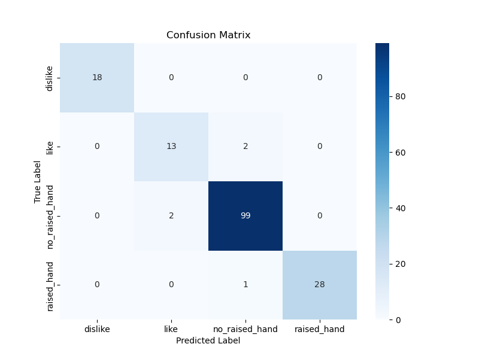

# Hand Gesture Recognition for Student Engagement (EduVision)

This project, part of the **EduVision** graduation project, implements a hand gesture recognition system to monitor student engagement during virtual or in-person meetings. The system uses MediaPipe for hand detection and cropping, and a ResNet50-based convolutional neural network (CNN) to classify hand gestures into four categories: `dislike`, `like`, `no_raised_hand`, and `raised_hand`. The dataset was specifically created by the project author for this task, tailored to ensure accurate gesture recognition in educational settings, focusing on real-time detection to enhance student interaction.

## Project Overview

EduVision aims to improve student engagement by recognizing hand gestures that indicate participation or feedback, such as raising a hand or expressing approval/disapproval. The custom dataset was developed to address the specific needs of educational environments, ensuring the system is robust for classroom or meeting scenarios. The project includes four main Python scripts:

1. **Image Preprocessing**: Cropping hand regions from input images using MediaPipe and splitting the dataset into train, validation, and test sets.
2. **Model Training**: Training a ResNet50 model with transfer learning to classify hand gestures.
3. **Model Evaluation**: Evaluating the trained model on the test set with metrics like accuracy, precision, recall, F1-score, and confusion matrix.
4. **Real-Time Detection**: Performing real-time hand gesture recognition using a webcam.

The `no_raised_hand` class, particularly for hands on the face, required significant real-time tuning to avoid misinterpretations as sign language gestures, ensuring stable and accurate classification.

## Dataset

The dataset was created specifically for the EduVision project and is not sourced from external datasets(I'm the one who made it). It includes images categorized into four classes designed to monitor student engagement:

- `dislike`
- `like`
- `no_raised_hand` (includes hands on the face or other non-raised positions)
- `raised_hand`

After cropping and splitting, the dataset is distributed as follows:

- **Train**:
  - `dislike`: 87 images
  - `like`: 69 images
  - `no_raised_hand`: 469 images
  - `raised_hand`: 133 images
- **Validation**:
  - `dislike`: 19 images
  - `like`: 15 images
  - `no_raised_hand`: 100 images
  - `raised_hand`: 28 images
- **Test**:
  - `dislike`: 18 images
  - `like`: 15 images
  - `no_raised_hand`: 101 images
  - `raised_hand`: 29 images

## Model Performance

The ResNet50 model, fine-tuned with transfer learning, achieved the following performance on the test set:

- **Accuracy**: 96.93%
- **Per-class Metrics**:
  - `dislike`: Precision=1.00, Recall=1.00, F1=1.00
  - `like`: Precision=0.87, Recall=0.87, F1=0.87
  - `no_raised_hand`: Precision=0.97, Recall=0.98, F1=0.98
  - `raised_hand`: Precision=1.00, Recall=0.97, F1=0.98
- **Confusion Matrix**:
  

The best model was saved after achieving **99.38% validation accuracy** at epoch 20, with early stopping triggered after epoch 27.

## Project Structure

```plaintext
├── README.md                       # Project documentation
├── config.py                       # Configuration settings (paths, parameters, constants)
├── confusion_matrix.png            # Visualization of classification results
├── data_preprocessing.py           # Script for preparing and augmenting datasets
├── model_evaluation.py             # Evaluate the trained model's performance
├── model_saving.py                 # Save and load model checkpoints
├── model_training.py               # Model training script
├── real_time_detection.py          # Real-time hand gesture detection
├── requirements.txt                # Contains needed libraries
├── Hand images/                    # Input images organized by class
├── Hand_images_cropped/            # Cropped hand images
├── Hand_images_cropped_split/      # Split dataset (train, val, test)
│   ├── train/
│   ├── val/
│   ├── test/
├── models/                         # Saved model weights
│   └── best_model.pth
```

## Prerequisites

Python 3.8+
Libraries:
```bash
pip install opencv-python mediapipe torch torchvision Pillow scikit-learn matplotlib seaborn numpy
```

## Setup

- Clone the Repository:
```bash
git clone https://github.com/your-username/Hand-Gesture-Recognition.git
cd Hand-Gesture-Recognition
```

- Prepare the Dataset:

Place your input images in the Hand images directory, organized by class (e.g., Hand images/dislike/, Hand images/like/, etc.).
Update the BASE_PATH in config.py if your directory structure differs.

- Install Dependencies:
```bash
pip install -r requirements.txt
```
The requirements.txt file contains:
```
opencv-python
mediapipe
torch
torchvision
Pillow
scikit-learn
matplotlib
seaborn
numpy
```

## Usage

- Preprocess and Split Dataset:
Run the preprocessing script to crop hand regions and split the dataset:
```bash
python data_preprocessing.py
```
This will:

Crop hand regions using MediaPipe and save them to Hand_images_cropped.
Split the cropped images into Hand_images_cropped_split/train, val, and test with a 70-15-15 ratio.
Print the number of images per class in each split for verification.

- Train the Model:
Train the ResNet50 model:
```bash
python model_training.py
```
The model will be saved as models/best_model.pth after training, with progress logged for each epoch.
- Save/Load Model Checkpoints:
Use the model saving script to manage checkpoints:
```bash
python model_saving.py
```
This handles saving and loading the trained model for reusability.
- Evaluate the Model:
Evaluate the trained model on the test set:
```bash
python model_evaluation.py
```
This generates a confusion matrix plot (confusion_matrix.png) and prints performance metrics, including accuracy, precision, recall, and F1-score.
- Real-Time Detection:
Run real-time gesture recognition using a webcam:
```bash
python real_time_detection.py
```

The webcam feed will display detected hand gestures with bounding boxes and classification labels.
Press q to exit.

## Configuration

All paths and parameters are defined in config.py. Key settings include:

BASE_PATH: Root directory for input and output folders (D:\Telegram Downloads\Graduation Project\Latest from ALL\Hand_Gesture).
IMG_HEIGHT, IMG_WIDTH: Image dimensions for model input (224x224).
TRAIN_RATIO, VAL_RATIO, TEST_RATIO: Dataset split ratios (0.7, 0.15, 0.15).
CLASS_NAMES: Gesture classes (dislike, like, no_raised_hand, raised_hand).
CLASS_COUNTS: Initial class counts for weighting ([89, 89, 470, 188]). Update these after running data_preprocessing.py if needed.
MAX_NUM_HANDS, MIN_DETECTION_CONFIDENCE: MediaPipe parameters for hand detection.
BATCH_SIZE, LEARNING_RATE, NUM_EPOCHS, PATIENCE_EARLY_STOPPING: Training hyperparameters.

To modify settings, edit config.py before running the scripts.

## Notes

Custom Dataset: The dataset was created specifically for this project to monitor student engagement in educational meetings, ensuring relevance to classroom scenarios. It was not downloaded from external sources.
No Raised Hand Tuning: The no_raised_hand class, particularly for hands on the face, required significant real-time tuning to avoid misinterpretations as sign language gestures, ensuring stable classification in dynamic environments.
Class Imbalance: The dataset is imbalanced, with no_raised_hand having significantly more images (469 in train) compared to others (e.g., 69 for like). The training script uses WeightedRandomSampler to address this.
Dynamic Class Counts: The CLASS_COUNTS in config.py may need updating after cropping, as multiple hands per image can change the counts. Check the output of data_preprocessing.py (e.g., train: [87, 69, 469, 133]) and update config.CLASS_COUNTS manually if needed.
Webcam Compatibility: If the default webcam (cv2.VideoCapture(0)) fails, the script tries an alternative index (cv2.VideoCapture(1)).
Environment: Ensure a GUI environment for model_evaluation.py (to save confusion_matrix.png) and real_time_detection.py (for webcam display). The confusion matrix is saved to a file to support non-GUI environments.

## Troubleshooting

Empty Split Folders: Verify that Hand_images_cropped contains images and that class names match config.CLASS_NAMES. Check the output of data_preprocessing.py for errors during cropping or splitting.
Model Loading Errors: Ensure best_model.pth exists in models/ and matches the ResNet50 architecture with 4 output classes.
Webcam Issues: Confirm webcam availability. If issues persist, modify real_time_detection.py to try additional indices or use an external camera.
Library Errors: Ensure all dependencies in requirements.txt are installed. Run pip install -r requirements.txt to resolve.
Class Count Mismatch: If training performance is poor, verify CLASS_COUNTS in config.py matches the actual dataset counts after splitting.

## Future Improvements

Implement dynamic calculation of CLASS_COUNTS based on the cropped dataset to avoid manual updates.
Add support for additional image formats (e.g., .bmp) in data_preprocessing.py.
Enhance data augmentation (e.g., random cropping, color jitter) to improve model robustness.
Optimize real-time detection for lower latency, critical for real-time student engagement monitoring.
Integrate with a broader system for comprehensive classroom analytics, such as tracking participation trends.

## License

This project is licensed under the MIT License. See the LICENSE file for details.

## Contact for Model and Dataset

For questions or issues, please open an issue on GitHub or contact [mohamedmahmoud2022.333@gmail.com].
